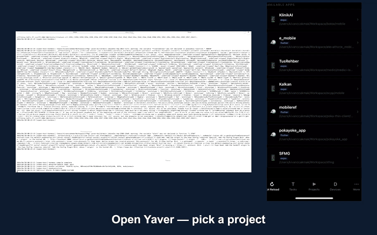

# Yaver

[](https://github.com/kivanccakmak/yaver.io/actions/workflows/test-suite.yml)
[](docs/planning/LICENSING.md)

**Yaver is a local-first developer toolkit for driving coding agents, previews, feedback, and deploy loops from your phone.**

Your code stays on your machine. The mobile app is the remote control; the `yaver` agent runs on your Mac, Linux box, WSL machine, Pi, or VPS; the SDK captures feedback from your own dev builds.

<p align="center">
  <a href="https://github.com/kivanccakmak/yaver.io/releases/download/yaver-hosting-demo-v1/yaver-hosting-demo.mp4">
    
  </a>
</p>

<p align="center">
  <a href="https://github.com/kivanccakmak/yaver.io/releases/download/yaver-hosting-demo-v1/yaver-hosting-demo.mp4">Watch the landing demo</a>
</p>

## What Works Today

- Run Claude Code, Codex, OpenCode, Aider, Goose, or another terminal agent from the Yaver agent.
- Push React Native / Expo bundles to a paired phone through the native Hermes path.
- Capture dev-build feedback with screenshots, logs, and replay context.
- Stream task, build, and reload progress back to mobile or the web dashboard.
- Keep peer discovery, relay, and vault flows local-first and self-hostable.
- Use SDKs and examples for React Native, Flutter, web, Unity, Go, Python, and JS/TS.

## Quick Start

```bash
npm install -g yaver-cli
yaver auth
yaver serve
```

For headless machines:

```bash
yaver auth --headless
yaver serve
```

If an AI coding agent is setting Yaver up for you, read the canonical machine guide first:

```bash
curl -s https://yaver.io/llms.txt
```

## Core Loop

1. Start `yaver serve` on your own machine.
2. Pair the mobile app or web dashboard with that agent.
3. Send a task to your coding agent from the phone.
4. Watch terminal/build/reload progress live.
5. Push the fix to a real device or deploy from your own machine when ready.

## Repository Map

| Path | Purpose |
|---|---|
| `desktop/agent/` | Go agent, CLI surfaces, local API, relay/P2P/runtime integrations |
| `mobile/` | React Native mobile app and native preview container |
| `web/` | Next.js marketing site and dashboard |
| `backend/convex/` | Hosted identity, session, and device-discovery metadata |
| `relay/` | QUIC relay service |
| `sdk/` | Public SDKs and feedback clients |
| `demo/` | Small fixture apps used to test SDK and push flows |
| `demo-videos/` | Source notes for the landing/demo clips |
| `docs/` | Architecture notes, setup guides, audits, handoffs, and planning material |

## Documentation

- [Docs index](docs/README.md)
- [Setup](docs/setup/SETUP.md)
- [Contributing](docs/setup/CONTRIBUTING.md)
- [Runtime architecture](docs/architecture/AI_ARCH.md)
- [Protocol](docs/yaver-protocol.md)
- [Feedback SDK](docs/mobile/FEEDBACK_SDK.md)
- [Security](docs/security/SECURITY.md)
- [License](docs/planning/LICENSING.md)

Markdown in this repo is context, not source of truth. If a doc and the code disagree, trust the code and fix the doc in the same change.

## Development

```bash
# Web dashboard / landing
cd web
npm install
npm run dev

# Go agent tests
cd desktop/agent
go test ./...
```

Run the narrower package tests for the area you change; the full repo spans Go, Node, React Native, Swift, Kotlin, Flutter, Unity, and embedded C work.

## License

Core Yaver code is under FSL-1.1-Apache-2.0. SDK packages are Apache-2.0 where marked. See [docs/planning/LICENSING.md](docs/planning/LICENSING.md).
