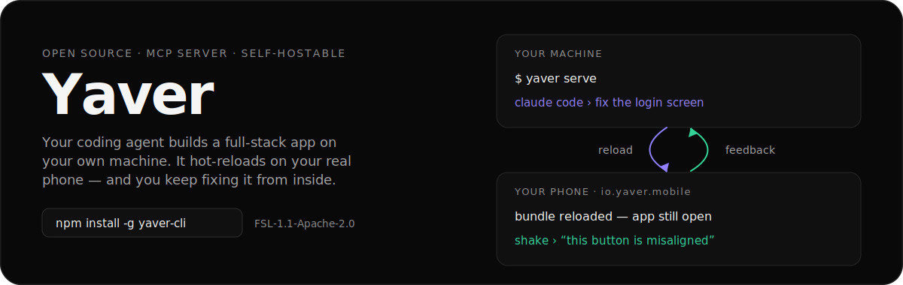
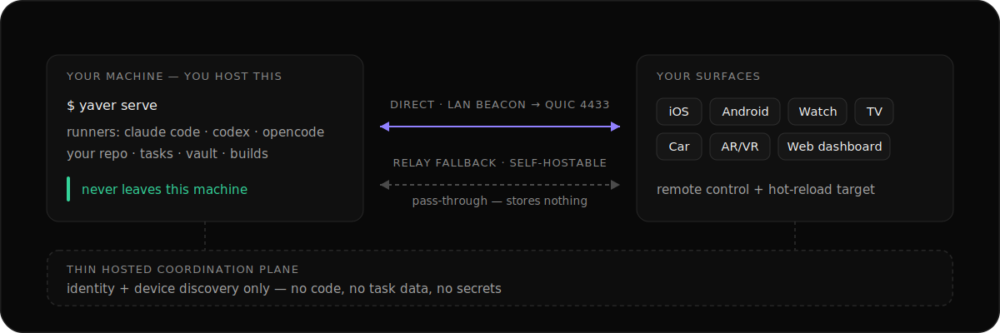

<p align="center">
  
</p>

<p align="center">
  <a href="https://github.com/yaver-io/yaver.io/actions/workflows/test-suite.yml"></a>
  <a href="https://www.npmjs.com/package/yaver-cli"></a>
  <a href="docs/planning/LICENSING.md"></a>
</p>

<p align="center">
  <a href="https://github.com/yaver-io/yaver.io/releases/download/yaver-hosting-demo-v1/yaver-hosting-demo.mp4">
    
  </a>
</p>

<p align="center">
  <a href="https://github.com/yaver-io/yaver.io/releases/download/yaver-hosting-demo-v1/yaver-hosting-demo.mp4"><sub>Watch the full demo →</sub></a>
</p>

## What Yaver is

AI writes the code in seconds. The loop around it — build, install, reproduce, describe what's wrong, get back to the agent — still takes hours. Yaver closes that loop.

The `yaver` agent runs on hardware you already own: a Mac, a Linux box, a WSL machine, a Pi, or a VPS. Your coding agent works there, against your real repo. Every other surface — phone, watch, TV, car, AR/VR, browser — is a remote control and a preview target for that one machine.

**It runs on the AI subscription you already pay for — no token markup, and your code never leaves your machine.**

iOS and Android are the deepest path today. Watch, TV, car, and AR/VR surfaces live in this repo and share the same core.

## Quick start

```bash
npm install -g yaver-cli
yaver auth
yaver serve
```

On a headless box (Pi, VPS, SSH-only), `yaver auth --headless` prints a short code and a URL you can open from any browser.

`npm` is the only supported install path, on macOS (Apple Silicon + Intel), Linux (x64 + arm64), and Windows via WSL2. It downloads a signed, notarized agent binary for your platform.

Then grab the app and pair it with that machine:

<p align="center">
  <a href="https://apps.apple.com/us/app/yaver-io/id6760467669"></a>
  <a href="https://play.google.com/store/apps/details?id=io.yaver.mobile"></a>
</p>

Open Yaver, pick a project from your dev box, preview it on your phone, shake to vibe-code — fix a bug, ship a small feature, or tweak a style — and a fresh bundle lands in seconds. One screen, real device, no extra hardware.

## Use it from your coding agent

Yaver ships an MCP server, so Claude Code, Codex, or opencode can drive your machine directly. You don't need a global install first — `npx` pulls the server on first run. Register it once, then ask the agent to call `yaver_lazy_setup`; it surfaces a sign-in link and pairs your device from inside the chat.

```bash
# Claude Code
claude mcp add --scope user yaver -- npx -y yaver-cli yaver-mcp

# Codex
codex mcp add yaver -- npx -y yaver-cli yaver-mcp

# opencode
npm install -g yaver-cli && yaver mcp setup opencode
```

Already installed globally? `yaver mcp setup claude-code` (or `codex` / `opencode`) writes the same entry, and `yaver auth` auto-registers every installed runner on first sign-in. Yaver is published to the official MCP registry as `io.github.yaver-io/yaver`. Codex Desktop can also load the repo-local plugin in [`plugins/yaver`](plugins/yaver).

Full tool list and HTTP/remote setup: **[MCP guide](https://yaver.io/docs/mcp)**.

## How it works

<p align="center">
  
</p>

1. Start `yaver serve` on your own machine.
2. Pair a surface — the mobile app, the web dashboard, or another Yaver client.
3. Send a task to your coding agent from whichever surface is nearest.
4. Watch terminal, build, and reload progress stream back live.
5. Push the fix to a real device, or deploy from your own machine when it's ready.

The CLI, agent, relay, and backend are all self-hostable. Client apps currently reach you through a thin hosted coordination plane for identity and device discovery; full client self-host is on the way.

For remote access, Yaver Relay is the default path. The free shared relay is for
light personal use and has fair limits; paid Relay Pro gives daily users a
private managed relay with higher limits.

## What works today

- Drive Claude Code, Codex, OpenCode, Aider, Goose, or another terminal agent from the Yaver agent.
- Push React Native / Expo bundles to a paired phone through the native Hermes path.
- Capture dev-build feedback with screenshots, logs, and replay context.
- Stream task, build, and reload progress to mobile or the web dashboard.
- Keep peer discovery, relay, and vault flows local-first.
- Build against SDKs and examples for React Native, Flutter, web, Unity, Go, Python, and JS/TS.

## What it costs

**A solo developer can start with the open-source stack at $0.**

| Component | Runs on | Cost |
|---|---|---|
| Yaver CLI + agent | Your dev machine | $0 |
| Yaver surface apps | iOS / Android / watch / TV / car / AR/VR | $0 |
| Web dashboard | Browser | $0 |
| Backend on your own machine | Your Mac / Linux / WSL / VPS | $0 + your hardware |
| Yaver shared relay | Yaver-hosted, fair-use limited | $0 |
| AI models (Ollama) | Your GPU or CPU | $0 |

The open-source stack includes the mobile app, CLI, agent, web dashboard, SDKs,
and relay implementation. Yaver's shared relay is available with fair limits for
getting started. Your coding agent brings its own login or subscription — Yaver
never resells tokens.

Optional paid products are for convenience and reliability: Relay Pro for a
private managed relay, and Cloud Workspace for people who do not want to run
their own always-reachable box.

## Repository map

| Path | Purpose |
|---|---|
| `desktop/agent/` | Go agent, CLI surfaces, local API, relay/P2P/runtime integrations |
| `mobile/` | React Native mobile app and native preview container |
| `watch/`, `wear/`, `tvos/` | Apple Watch, Wear OS, and Apple TV client surfaces |
| `web/` | Next.js marketing site and dashboard |
| `backend/convex/` | Hosted identity, session, and device-discovery metadata |
| `relay/` | QUIC relay service |
| `sdk/` | Public SDKs and feedback clients |
| `demo/` | Small fixture apps used to test SDK and push flows |
| `demo-videos/` | Source notes for the landing/demo clips |
| `docs/` | Architecture notes, setup guides, audits, handoffs, and planning material |

## This repo is the monorepo

**Yaver is one monorepo — this one.** Agent, CLI, mobile, watch, TV, car,
AR/VR, web, relay, backend, and SDKs all live here and ship together. Splitting
them would only buy version skew between surfaces that have to agree.

Everything else in the [`yaver-io`](https://github.com/yaver-io) org is a
**validation / use-case app** — something whose only job is to exercise Yaver
from the outside. Those are separate repos precisely because they must be
clonable, buildable, and breakable on their own, exactly as a user's project
is. If they lived in here they'd inherit this repo's tooling and stop being an
honest test.

The rule: **product code goes in this repo; anything that tests the product
from outside gets its own repo.**

## Validation apps

The apps that prove Yaver works live in their own repos, not in this one. They
are **local-only** todo apps — no backend, no accounts, no network — and they
are deliberately boring, because they are the control.

The same todo app is built five ways. Yaver reaches each one differently, so
when the loop feels different across stacks, it is the transport that differs
and not the app:

| Repo | Stack | How Yaver reaches it |
|---|---|---|
| [yaver-todo-rn](https://github.com/yaver-io/yaver-todo-rn) | Expo / React Native | **Hermes** — the agent compiles an HBC bundle and the container swaps it in place |
| [yaver-todo-kt](https://github.com/yaver-io/yaver-todo-kt) | Native Android (Kotlin) | **native-webrtc** — runs on a build host, H.264 streamed to the phone, taps sent back |
| [yaver-todo-swift](https://github.com/yaver-io/yaver-todo-swift) | Native iOS (SwiftUI) | **native-webrtc** — same, macOS build host only |
| [yaver-todo-flutter](https://github.com/yaver-io/yaver-todo-flutter) | Flutter / Dart | **native-webrtc** — Dart has no Hermes equivalent |
| [yaver-todo-web](https://github.com/yaver-io/yaver-todo-web) | Next.js | **dev server** — HMR through Yaver's relay path |

Hermes is React-Native-only: native and Flutter apps compile to real binaries
and can never be loaded into the Yaver container. That is why three of the five
exist — they are the only honest way to exercise the streaming path.

They are separate repos so they can be cloned, built, and broken without
touching this one. Each README states what works and what doesn't per stack,
including where a feedback SDK does not exist yet.

## Documentation

[Docs index](docs/README.md) · [Setup](docs/setup/SETUP.md) · [Contributing](docs/setup/CONTRIBUTING.md) · [Runtime architecture](docs/architecture/AI_ARCH.md) · [Protocol](docs/yaver-protocol.md) · [Feedback SDK](docs/mobile/FEEDBACK_SDK.md) · [Security](docs/security/SECURITY.md) · [License](docs/planning/LICENSING.md)

If an AI coding agent is setting Yaver up for you, point it at the canonical machine guide first:

```bash
curl -s https://yaver.io/llms.txt
```

> Markdown in this repo is context, not source of truth. If a doc and the code disagree, trust the code and fix the doc in the same change.

## Development

```bash
# Web dashboard / landing
cd web && npm install && npm run dev

# Go agent tests
cd desktop/agent && go test ./...
```

Run the narrower package tests for the area you change — the repo spans Go, Node, React Native, Swift, Kotlin, Flutter, Unity, and embedded C.

## License

The repo uses a split license: the core is **FSL-1.1**, which auto-converts to Apache-2.0 after two years, and the client SDKs are **Apache-2.0** so you can embed them in closed-source apps. See [docs/planning/LICENSING.md](docs/planning/LICENSING.md).

If your legal team needs the core under different terms, a commercial license is available — email kivanc.cakmak@simkab.com.
