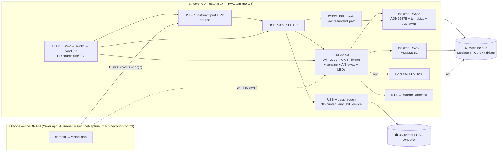

# Yaver Connector Box (a.k.a. Yaver Machine Connector)

> **Status note (read `../README.md` first).** This is **Widget C** of three edge
> form factors. For the **phone-brain** path (the common case) the box is now
> **passive**: an isolated USB-RS485 (+ optional RS232 / USB-A passthrough / USB-C
> PD charging) breakout — **no MCU, no firmware**. The ESP32-S3 design + firmware
> below are **kept but deprecated as a brain** ("ESP is trouble"): when you want
> compute/wireless at the edge, use the **Raspberry Pi** widget (`../yaver-edge-pi/`,
> Widgets A & B) which runs the full Yaver agent with zero custom firmware. The
> isolation/RS485/charging hardware design here is still the reference for the
> passive box.

A plug-and-play **facade box** between a phone running the Yaver mobile app and an
industrial machine. The technician connects the phone to the box (USB-C **or**
Wi-Fi), the box breaks out to the machine's bus (RS485 / RS232 / USB / optional
CAN), and from the Yaver app they can observe, deep-analyze, and *drive* the
machine — a 3D printer used as a Cartesian robot, a real robot arm, a Modbus/S7
PLC, or any industrial controller — with the phone's camera watching the work.

> **Core design principle — the box is a FACADE, not a PC.**
> It contains a microcontroller (ESP32-S3) + serial transceivers + a USB hub +
> power. It runs **no operating system and never runs Yaver itself**. All
> intelligence — the AI runner (Claude Code), vision, the `netcapture`
> deep-analysis engine, `machine`/`robot` control — lives on the **phone**. The
> box only bridges the wire and brokers power. This keeps it cheap, certifiable,
> reboot-instant, and impossible to "rot" like an SBC.

This pairs with the software already in the repo:
- `desktop/agent/netcapture/` — wire-observe & deep-analysis (Modbus/S7/OPC-UA/TDS/HTTP + RS232/RS485). See [project memory `project_netcapture_wire_analysis`].
- `desktop/agent/machine/` — Modbus read/sniff/write.
- `desktop/agent/robot/` — Marlin/G-code Cartesian control + camera-verify loop + companion force/torque MCU.
- The Yaver mobile app — the brain that does the "vibe with the machine" loop.

---

## Two connection modes (one board)

| | **Wired mode** | **Wireless mode** |
|---|---|---|
| Phone link | USB-C cable (phone = USB host + charges) | Wi-Fi: phone joins the box's **SoftAP** |
| Camera placement | tethered (cable-length limited) | **free** — put the phone on a stand/gooseneck/tripod aimed at the machine for vibing |
| Box role | powered USB hub + serial breakout | ESP32-S3 Wi-Fi↔serial **gateway** (SoftAP, Modbus-TCP + WebSocket + raw-TCP bridge) |
| Charging | yes — box charges the phone via USB-C PD while it hosts | phone on its own charger; box self-powered |
| Infra needed | none | none — SoftAP, no factory Wi-Fi required |
| "PC?" | no — dumb hub + bridges | no — microcontroller SoftAP, no OS |

The wireless mode exists precisely so the **camera can be positioned out of cable
scope** — the phone sees the whole machine while still talking to the bus through
the box. Wired mode exists for the lowest-latency, no-RF, charge-while-you-work
bench/panel case. Both are the same hardware; firmware picks the path.

---

## Block diagram

---

## I/O

**Machine side (pluggable 3.5 mm screw terminals + USB-A):**
- **RS485** (isolated): `A` `B` `GND_ISO` — Modbus-RTU, drives, most PLCs. DIP: 120 Ω termination on/off, fail-safe bias on/off. **Software/relay A↔B swap** (RS485 polarity is not standardized — see gotchas).
- **RS232** (isolated): `TX` `RX` `GND_ISO` — legacy controllers, some CNC.
- **USB-A host passthrough**: 3D-printer USB (CH340/FTDI on the printer), or any USB-serial device. Phone hosts it through the box hub.
- **CAN** (optional populate): `CANH` `CANL` — some robot arms / CANopen.
- **2× GPIO/relay** (optional): e-stop sense / tool enable, driven by the ESP32 (kept hard-isolated from any safety chain — advisory only).

**Phone side:** USB-C (host+charge) **or** Wi-Fi SoftAP.

**Power:** DC barrel/terminal **9–24 V** in (industrial 24 V friendly) *or* USB-C PD-in. Recommend a **24 V / 2 A (48 W)** supply for charge-while-host headroom.

---

## Charging while interacting — power & USB-C role analysis

The hard part of the wired mode is "phone is **USB host** to the box **and** the box
**charges the phone**." This is impossible cleanly on legacy micro-USB (the ID-pin
resistor hacks are per-phone lottery). It is clean on **USB-C**, because USB-C
**decouples data role from power role**:

- **Data role:** the box's upstream port is a **UFP** (device/up-facing hub port);
  the **phone is the DFP/host**. → the phone enumerates the box's hub + bridges.
- **Power role:** the box is the **Source** (it has the DC input); the **phone is
  the Sink** → it charges. Negotiated over **CC** with **USB Power Delivery**.

So the phone is `{Data: Host, Power: Sink}` and the box is `{Data: UFP, Power:
Source}` — exactly what a *powered USB-C dock* is. Android supports charging while
host in this configuration. Implementation: a **PD source controller (TPS65987D)**
on the upstream port advertises source PDOs (5 V/3 A, 9 V/2 A, 12 V/1.5 A) and the
hub's upstream PHY carries data.

**Power budget (worst case, wired):**

| Rail / load | V | I | P |
|---|---|---|---|
| Phone charge (PD) | 9 V | 1.67 A | **15 W** |
| USB-A passthrough (printer) | 5 V | 0.9 A | 4.5 W |
| USB hub FE1.1s | 3.3/5 V | ~0.1 A | 0.5 W |
| ESP32-S3 (Wi-Fi TX peaks) | 3.3 V | ~0.5 A peak | ~1.7 W |
| FT232 + isolated RS485 (ADM2587E iso-DCDC) | 5 V | ~0.15 A | 0.8 W |
| Isolated RS232 (ADM3251E) | 5 V | ~0.05 A | 0.3 W |
| **Total** | | | **≈ 23 W** |

→ DC input **24 V @ ≥ 2 A (48 W)** gives ~2× margin. Buck #1 (TPS54360, 24→5 V/3 A)
feeds the 5 V rail; a buck-boost feeds the PD source's VBUS (5/9/12 V); LDO/buck
24→3.3 V for logic. Thermals: at 23 W draw and ~88 % buck efficiency the box
dissipates ~3 W — passive vents in the lid are sufficient; no fan (a fan would be
a PC-ism and a failure point). **In wireless mode the phone charges off its own
charger**, so the PD-source path can be unpopulated on a "wireless-only" SKU,
dropping cost.

**Deep-analysis hooks for charging:** the ESP32 reads VBUS/IBUS via the PD
controller's I²C telemetry and the DC-in via an INA219, and reports them on the
companion link — so the Yaver app can show "charging 9 V @ 1.6 A, box draw 0.7 A,
input 23.9 V" live and flag brown-outs/over-temp the same way `netcapture` flags
bus faults. (See `firmware/README.md`.)

---

## How "vibing with the machine" works end-to-end

1. **Plug in** — phone → box (USB-C or join the box's `Yaver-Box-XXXX` SoftAP).
2. **Yaver app auto-claims the link** — `android/device_filter.xml` matches the
   FTDI/CP210x/CH340 VID (wired) or the app finds the SoftAP gateway (wireless).
3. **Observe** — `netcapture` taps the bus: live Modbus/S7/RS485 frames + deep
   findings (exceptions, CRC errors, resets, latency, disconnect timeline).
4. **Learn** — `machine` sniffs/scans registers; the LLM labels them
   (`machine_understand`); for a printer/arm the `robot` Marlin/G-code path drives
   motion with the **camera + vision verdict gating each move**.
5. **Vibe** — natural-language → the on-phone runner issues `machine_write` /
   `robot` moves; the camera confirms; `netcapture` confirms on the wire. The box
   is just the pipe.

Because the brain is the phone, the **same box** drives a 3D printer as a Cartesian
robot, a real robot arm (RS485/CAN), or any Modbus/S7 industrial machine — the
machine-specific knowledge is software on the phone, not burned into the box.
Generic by construction (no machine model baked into hardware).

---

## Build plan — Rev A (modules) → Rev B (PCB)

Per the connector-box research (memory `project_netcapture_wire_analysis`), there
is **no off-the-shelf integrated product** — so:

- **Rev A — validate fast with modules** (no PCB spin): an isolated FTDI USB-RS485
  module (DSD TECH **SH-U11F** ~$20 / Waveshare **23949** $14.79) + a powered USB-C
  hub + an **ESP32-S3 DevKit** + a screw-terminal breakout + a 24→5 V buck, all
  hand-wired into the printed `enclosure.scad`. Proves firmware + the app flow +
  charging on the real target phones.
- **Rev B — integrated PCB** (`schematic.md` / `bom.csv` / `pcb.md`): one 4-layer
  board, JLCObrand assembly, the enclosure already fits it (board outline = enclosure
  inner footprint).

---

## Files in this folder

| File | What |
|---|---|
| `README.md` | this — architecture, modes, power/charging analysis, vibe flow |
| `schematic.md` | component-level design by functional block + a netlist table |
| `bom.csv` | bill of materials (refs, parts, LCSC/supplier, prices) |
| `enclosure.scad` | parametric OpenSCAD enclosure (base + lid, cutouts, DIN clip, antenna boss) |
| `phone_mount.scad` | parametric phone clamp + gooseneck/tripod/RAM interface (camera positioning) |
| `pcb.md` | board outline, stackup, placement, isolation/RF rules, JLCPCB fab notes |
| `firmware/README.md` | ESP32-S3 facade firmware **spec** (USB-CDC bridge + SoftAP gateway + companion sensing) |
| `firmware/platformio.ini` + `firmware/src/` | the actual buildable firmware (`pio run -t upload`) |
| `android/device_filter.xml` | Android USB-host VID/PID filter so the Yaver app auto-claims the wired bridges |
| `NO_PCB_QUICKSTART.md` | breadboard quick test (ESP32-S3 DevKit + modules, **no PCB**) — start here |
| `TRAVELER.md` | Rev-A modules build + QA route (the dogfood production traveler) |

## Variants (BOM populate options)

- **Wired-only** (cheapest): drop ESP32/antenna, keep hub + FTDI + PD source + RS485/RS232.
- **Wireless-only**: drop USB hub + PD source + USB-A, keep ESP32 + RS485/RS232 + DC-in.
- **Full** (default): everything, both modes.
- **+CAN**: populate SN65HVD230 for CANopen arms.

## Safety / certification notes (read before shipping)

- The box is **advisory** — it must never sit in a machine's safety chain. E-stop
  stays hardwired on the machine. GPIO/relay outs are convenience only.
- RS485/RS232 (and CAN) are **galvanically isolated** from the phone/USB ground —
  mandatory on a factory floor (ground-potential differences, VFD noise).
- Targets: CE/FCC unintentional-radiator (ESP32 module is pre-certified — use a
  module with modular approval to inherit it), creepage ≥ 4 mm across the isolation
  barrier, fused DC input. Not rated for hazardous (Ex) areas.
